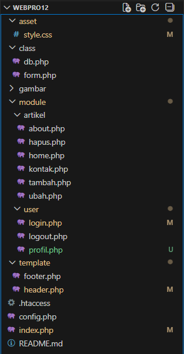

# Latihan Autentikasi Tahap Lanjut


Halo halo, Sekarang disini akan mencoba menggunakan data dari SQL untuk login.
Cek juga repo lain nya:
 [Html dasar](https://github.com/laLafid/Lab1Web), [CSS dasar](https://github.com/laLafid/lab2web), [CSS](https://github.com/laLafid/Lab3Web), [CSS Layout](https://github.com/laLafid/Lab4Web), [Dasar Javascript](https://github.com/laLafid/Lab5Web), [Dasar Bootstarp](https://github.com/laLafid/Lab6Web), [Dasar PHP](https://github.com/laLafid/Lab7Web), [CRUD PHP](https://github.com/laLafid/Lab8Web),  [Modular PHP](https://github.com/laLafid/Lab9Web), [OOP PHP](https://github.com/laLafid/Lab10Web) dan [OOP Lanjutan](https://github.com/laLafid/Lab11Web).


## Langkah-langkah

1. **Persiapan**
    - Editornya, misal Visual Studio Code.
    
    
    - XAMPP, kalo belum punya unduh dulu di [sini](https://www.apachefriends.org/).

    - Buka XAMPP control panel dulu, aktifin ``apache`` dan ``mysql`` lalu pencet admin dibagian ``mysql`` buat masuk ke phpmyadmin.
    

    - Pake Database sebelumnya, kalo belum punya cek [CRUD PHP](https://github.com/laLafid/Lab8Web)

    - Koneksi Database pake PHP

    
    
    liat ``config.php``

    - jangan lupa ya path file nya..

    


2. **Penerapan**

    - Tambahan di ``index.php``:
    ```php
    $public_pages = ['home', 'user']; 
    if (!in_array($mod, $public_pages)) {
        // Jika tidak ada session is_login, lempar ke halaman login
        if (!isset($_SESSION['is_login'])) {
            header('Location: ' . BASE_URL . 'user/login'); // Sesuaikan jika perlu
            exit();
        }
    }
    ```


    - Buat tabel baru di database untuk akun yang dipakai login
        - Tabel nya
        ```sql
        CREATE TABLE users (
        id INT AUTO_INCREMENT PRIMARY KEY,
        username VARCHAR(50) NOT NULL,
        password VARCHAR(255) NOT NULL,
        nama VARCHAR(100)
        );
        ```
        
        - Isian-nya dengan password ``admin123``
        ```sql
        INSERT INTO users (username, password, nama)
        VALUES ('admin', '$2y$10$wus4kmfZ2LKyKrIkKWyKHuKxXQtoViMVVcz9q.ZjYacKJ8ErdmRTW', 'Administrator'); 
        ```

        - untuk password di hashing dulu pake 
        ```php 
        password_hash('password di sini', PASSWORD_DEFAULT)
        ``` 


    - Update ``login.php`` untuk memakai tabel ``users``
    ```php
    $message = "";
    if ($_POST) {
        $db = new Database();

        // Ambil input dan sanitasi (basic)
        $username = trim($_POST['username'] ?? '');
        $password = $_POST['password'] ?? '';

        if ($username === '' || $password === '') {
            $message = "Username dan password harus diisi!";
        } else {

            // Query cari user berdasarkan username
            $sql = "SELECT * FROM users WHERE username = '{$username}' LIMIT 1";
            $result = $db->query($sql);
            $data = $result->fetch_assoc();

            // Verifikasi password
            if ($data && password_verify($password, $data['password'])) {
                // Login Sukses: Set Session
                $_SESSION['is_login'] = true;
                $_SESSION['username'] = $data['username'];
                $_SESSION['nama'] = $data['nama'];

                // Redirect ke halaman utama
                header('Location:' . BASE_URL . '/artikel/home');
                exit;
            } else {
                $message = "Username atau password salah!";
            }
        }
    }
    ```

    - File baru [profile.php](https://github.com/laLafid/Lab12Web/blob/cff1b93405542d8eeb679a6f7b6f5ef160a65623/module/user/profile.php) untuk tampilan profil user dan juga ganti password 

    - Tambahan di ``header.php`` untuk akomodasi ``profile.php`` dan filter user
    ```php
    <div class="collapse navbar-collapse" id="navbarNav">
        <ul class="navbar-nav me-auto mb-2 mb-lg-0">
            <li class="nav-item"><a class="nav-link" href="<?=BASE_URL ?>home/index">Home</a></li>
            <li class="nav-item"><a class="nav-link" href="<?= BASE_URL ?>artikel/about">Tentang</a></li>
            <li class="nav-item"><a class="nav-link" href="<?= BASE_URL ?>artikel/kontak">Kontak</a></li>
            <?php if (isset($_SESSION['is_login'])): ?> //dah login?
            <li class="nav-item"><a class="nav-link" href="<?=BASE_URL ?>artikel/home">Data Artikel</a></li>
        <?php endif; ?>
        </ul>

        <ul class="navbar-nav ms-auto">
            <?php if (isset($_SESSION['is_login'])): ?>
            <li class="nav-item"><a class="nav-link" href="<?=BASE_URL ?>user/profile">Profil</a></li>
            <li class="nav-item"><a class="nav-link" href="<?=BASE_URL ?>user/logout">Logout (<?=$_SESSION['nama'] ?? '' ?>)</a></li>
            <?php else: ?> // belum login, tampilin ini
            <li class="nav-item"><a class="nav-link" href="<?=BASE_URL ?>user/login">Login</a></li>
            <?php endif; ?>
        </ul>
    </div>
    ```


3. **Hasil Akhir**
    
    

    

    

    - Profile
    

    - Tambah Barang
    
    

    - Edit Barang
    
    

    - Delete Barang
    
    

    
## Akhri Kata


*Selamat mencoba*
